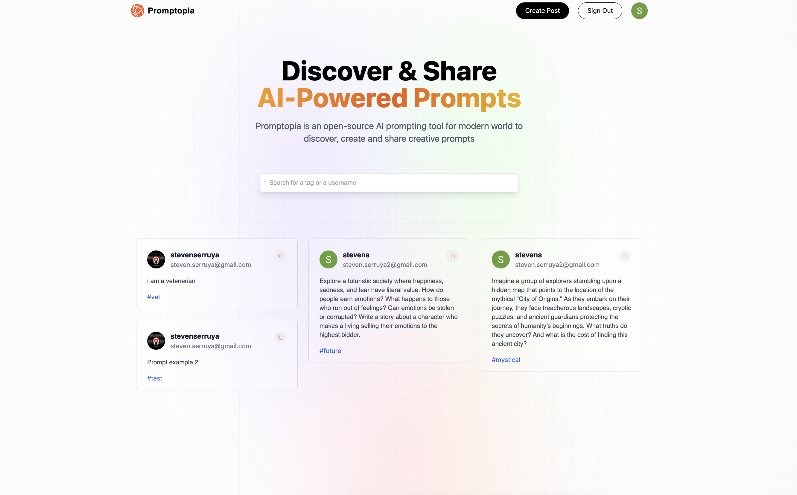
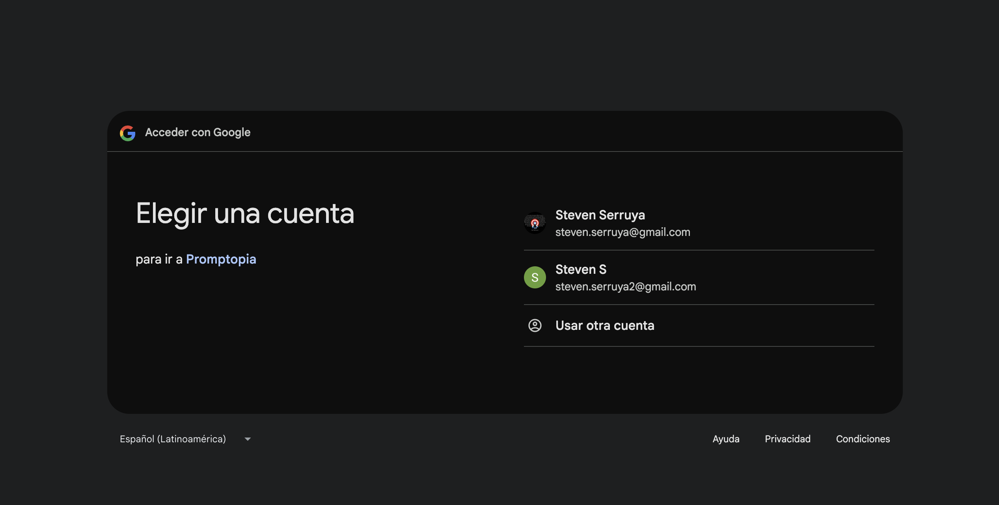
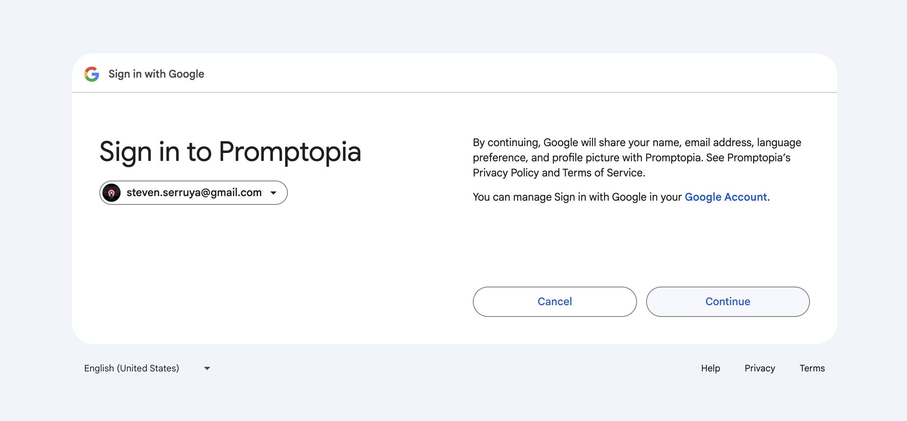
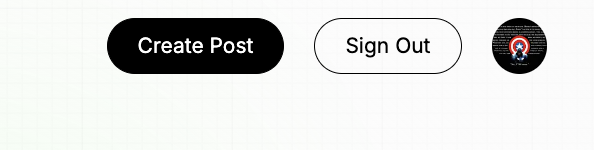
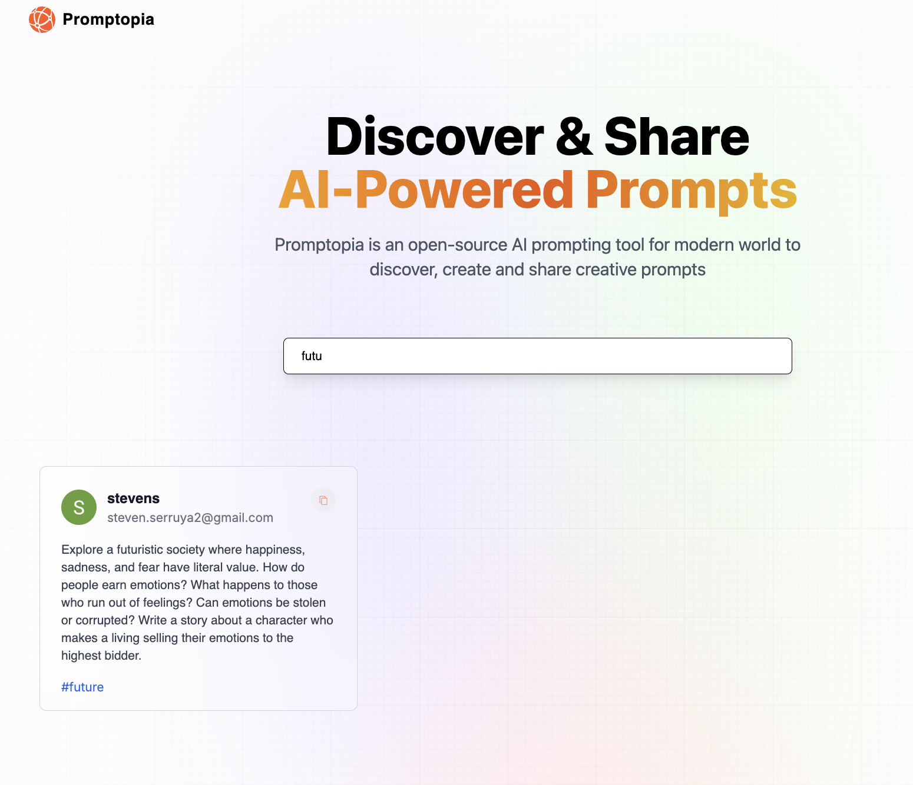
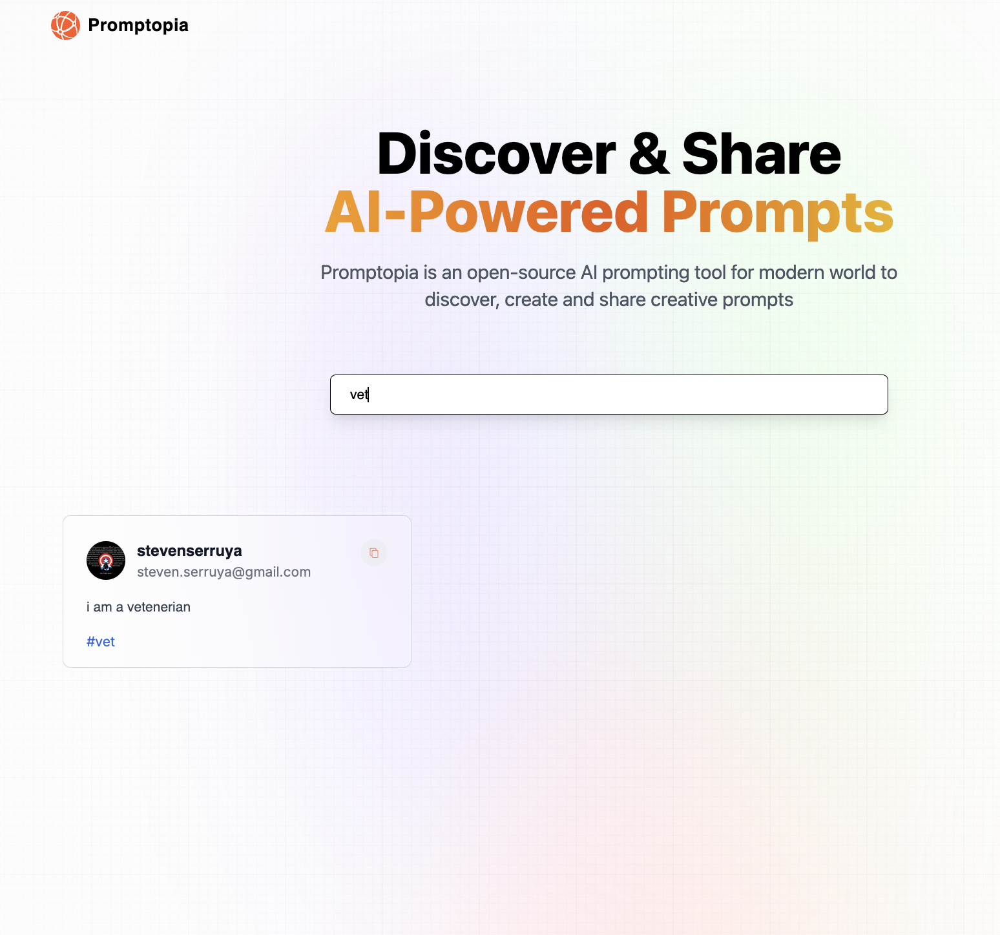
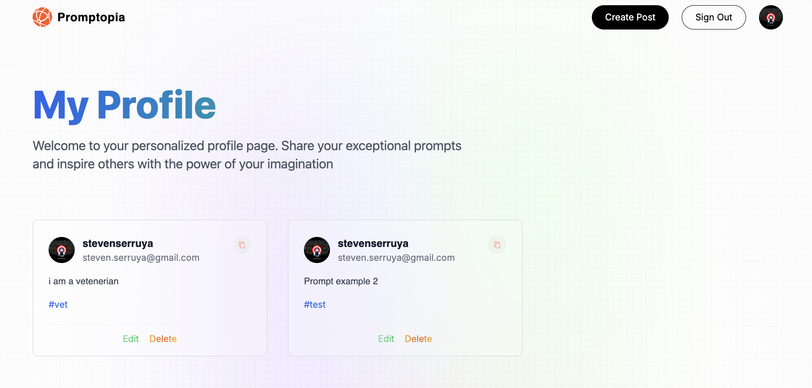
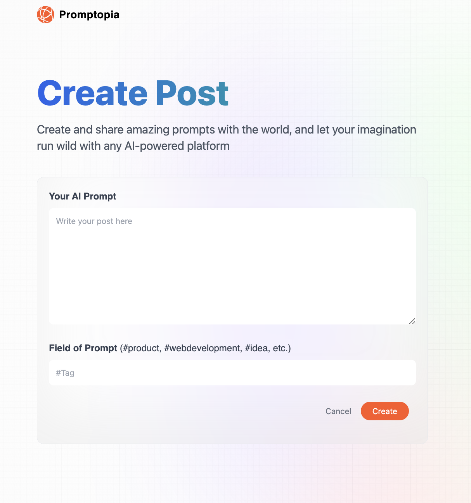
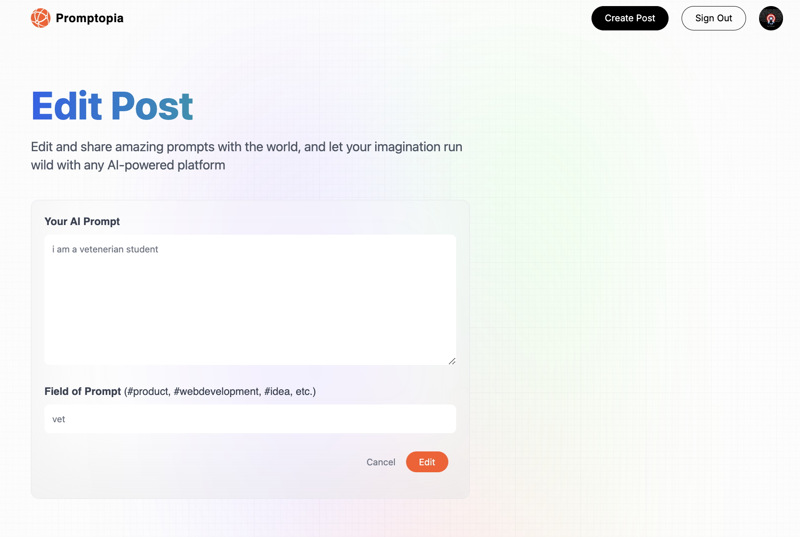
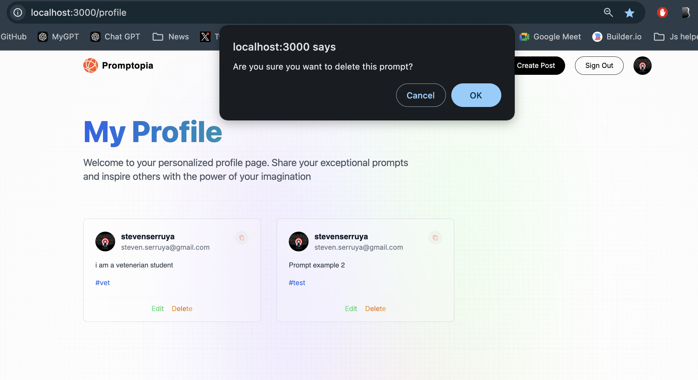

# Promptopia

**Promptopia** is a web application built with Next.js that allows users to sign in with Google OAuth, create and share AI prompts, and explore prompts shared by others. This app provides a streamlined interface for users to manage their AI prompts and interact with the community.
Made under the guidance of JS Mastery.

## Features
-***Built with Next.js**: The app leverages the power of server-side rendering and static site generation for a fast and dynamic user experience.
- **Google OAuth Integration**: Users can securely sign in with their Google accounts.
- **Create and Share Prompts**: Once signed in, users can create AI prompts and share them with the public.
- **View Prompts**: Prompts shared by all users are displayed in a main feed, allowing users to explore new ideas. Each prompt shows its creator and details.
- **User Profiles**: Users can visit profiles of others to view the prompts they’ve created.
- **Profile Management**: In your own profile, manage your prompts — edit or delete them as needed.
- **Session Management**: Easy sign-in and sign-out functionality, backed by session-based authentication.

## Technologies Used

- **Next.js**: A powerful framework for server-side rendering and static site generation.
- **NextAuth.js**: A flexible authentication solution for OAuth, allowing Google sign-ins.
- **MongoDB**: A NoSQL database for storing user profiles and prompts.
- **Mongoose**: An object data modeling (ODM) library for MongoDB, used to define the schema and handle data operations.

## How It Works

1. **Sign In with Google**: Use the "Sign in with Google" button to log in.
2. **Create a Prompt**: After logging in, you can create prompts with relevant tags and share them.
3. **Explore Prompts**: The main feed displays all prompts created by users. Clicking on a prompt shows the creator's profile.
4. **Manage Your Prompts**: Navigate to your profile to view the prompts you have created. You can delete or edit them directly from there.
5. **Log Out**: You can log out from your profile or from any page.

## Getting Started

To get a local copy of this project up and running, follow these steps:

### Prerequisites

- Node.js
- MongoDB Atlas (for database connection)
- Google Cloud OAuth credentials

### Installation

1. Clone the repository:
   git clone https://github.com/stevenserruya/promptopia.git

2. Install the dependencies:
  npm install

3. Set up your environment variables in a `.env` file (refer to `.env.example` for the format):
- MongoDB connection string
- Google OAuth credentials

4. Run the development server:
  npm run dev

### Screenshots

